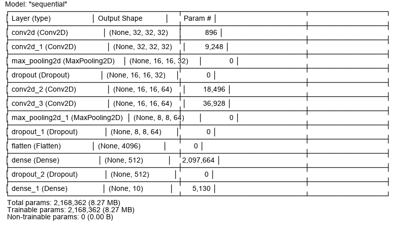
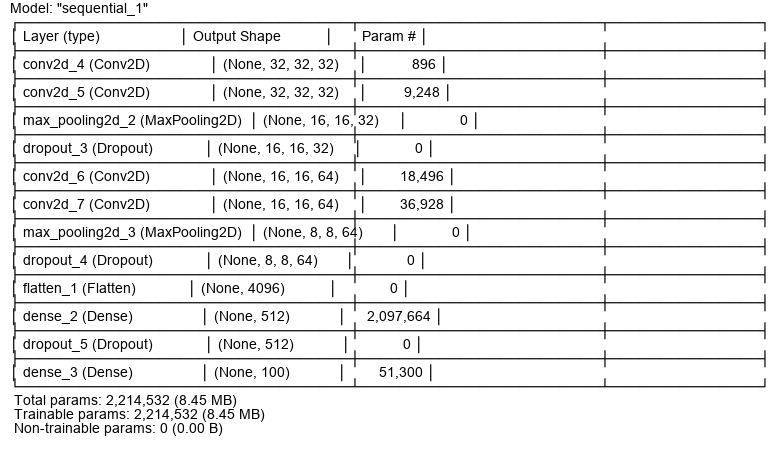

# KERAS - CIFAR10 and CIFAR100 Deep Learning

Train and test a Python Keras Deep Learning model to categorize different images and use it on your own.


## Cifar-10 and Cifar-100 Datasets

CIFAR-10 dataset consists of 60000 32x32 colour images in 10 classes, with 6000 images per class. There are 50000 training images and 10000 test images.

Here are the classes in the dataset, as well as 10 random images from each: ['airplane', 'automobile', 'bird', 'cat', 'deer', 'dog', 'frog', 'horse', 'ship', 'truck']

CIFAR-100 is a dataset of 50,000 32x32 color training images and 10,000 test images, labeled over 100 fine-grained classes that are grouped into 20 coarse-grained classes. 


## Deployment

Load the datasets with this methods:

```bash
  keras.datasets.cifar10.load_data()
  keras.datasets.cifar100.load_data()
```

The model then selects X and y and starts its training with 100 epoch, but EarlyStopping is set to stop useless epochs.

After training phase it shows a plot with accuracies and saves the model in local.

Then it asks user to continue, and you can load an image to make it categorize it.

## Neural Networks
Cifar10:


Cifar100:


## Conclusions
Cifar-10 model works pretty well with an accuracy of more than 80%.

Cifar-100 requires a better network, for now it stops at 45%.

After training they save models and you can reuse the code bypassing the training-phase.

You are ready to use the model for other images or other training, too! 💥

## Documentation

[CIFAR10 Keras](https://keras.io/api/datasets/cifar10/)

[CIFAR-100](https://keras.io/api/datasets/cifar100/)

