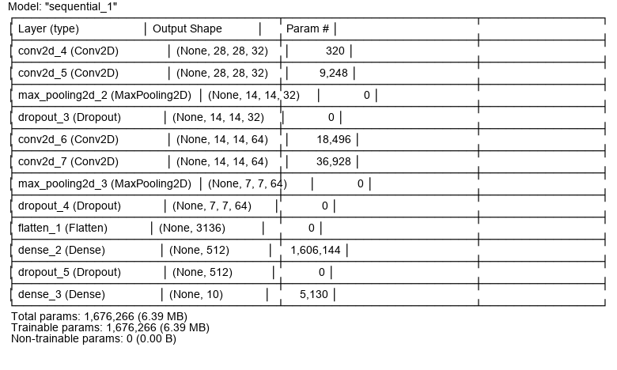

# KERAS - Fashion Mnist

Train and test a Python Keras Deep Learning model to categorize different clothes images and use it on your own.

## Fashion-Mnist Dataset

Fashion-MNIST is a dataset of Zalando's clothes images, consisting of a training set of 60,000 examples and a test set of 10,000 examples. Each example is a 28x28 grayscale image, associated with a label from 10 classes.

## Neural Network

## Conclusions
The model has a 94% accuracy, but there is a bit of overfitting. 💥

## Documentation

[Fashion-Mnist](https://github.com/zalandoresearch/fashion-mnist)

